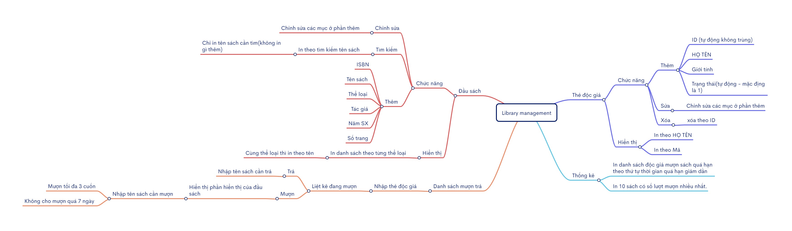

  This is a library management project
  Đồ án chủ đề về Quản lí thư viện.
----------------------------------------------------------------------------------------------------------------------------------------------------------------------------------------------------------
Thư viện: Ta tổ chức các danh sách sau: 
- Đầu sách : danh sách tuyến tính là 1 mảng con trỏ (ISBN , Tên sách, Số trang, Tác giả, năm xuất bản, thể loại, con trỏ dms): con trỏ sẽ trỏ đến các sách thuộc đầu sách tương ứng. Danh sách đầu sách luôn tăng dần theo tên sách.
- Danh mục sách : danh sách liên kết đơn( Mã sách,  trạng thái, vị trí   ). Mỗi cuốn sách chỉ có 1 mã duy nhất; trạng thái của sách bao gồm: 0: cho mượn được, 1: đã có độc giả mượn, 2: sách đã thanh lý . 
- Danh sách thẻ độc giả: cây nhị phân tìm kiếm (MATHE (số nguyên ngẫu nhiên tự động), Ho, Ten,  Phai, trạng thái của thẻ, con trỏ): con trỏ sẽ trỏ đến danh sách các cuốn sách đã và đang mượn.
- Danh sách MUONTRA : danh sách liên kết đơn ( MASACH,  NgayMuon, NgayTra, trạng thái): trạng thái =0 là sách đang mượn (chưa trả), =1 là đã trả, =2 : làm mất sách 

Chương trình có các chức năng sau: 
<ol reversed>
  <li> Nhập thẻ độc giả: thêm / xóa / hiệu chỉnh thông tin thẻ độc giả. Mã thẻ độc giả được chương trình tự động lấy ngẫu nhiên và không trùng với các mã thẻ độc giả cũ; Phái chỉ nhận ‘Nam’ hoặc ‘Nữ’; trạng thái thẻ = 0 khi thẻ bị khóa, trạng thái thẻ = 1 khi thẻ  đang hoạt động (được quyền mượn sách). </li> 
  <li>  In danh sách độc giả : in ra màn hình theo thứ tự tên+họ tăng dần hoặc theo thứ tự mã độc giả tăng dần theo yêu cầu của thủ thư.</li>
  <li>  Nhập thông tin đầu sách và đánh mã sách tự động (ISBN = 2 kí tự chữ + 2 kí tự số);(Mã sách = ISBN + 0001, số tăng dần);</li>
  <li>  In danh sách các đầu sách trong thư viện theo từng thể loại, trong từng thể loại thì in theo thứ tự tên sách tăng dần. (P->dms)</li>
  <li>  Tìm thông tin sách dựa vào tên sách : in ra các thông tin mã ISBN, tên sách, tác giả, năm xuất bản, thể loại, các mã sách , trạng thái mã sách trong thư viện.</li>
  <li>  Mượn sách : nhập vào mã thẻ độc giả, chương trình sẽ liệt kê các sách mà độc giả đang mượn. Mỗi độc giả chỉ được mượn tối đa 3 cuốn, không cho mượn khi giữ 1 sách quá hạn (7 ngày)</li>
  <li>  Trả sách </li>
  <li>  Liệt kê danh sách các mã sách, tên sách mà 1 độc giả có số thẻ X đang mượn</li>
  <li>  In danh sách độc giả mượn sách quá hạn theo thứ tự thời gian quá hạn giảm dần</li>
  <li>  In 10 sách có số lượt mượn nhiều nhất.</li>
</ol>

<h2>Mindmap: </h2>

My partner: <a href="https://github.com/hungphitran">hungphitran</a>
Deadline: 15/12/2023

